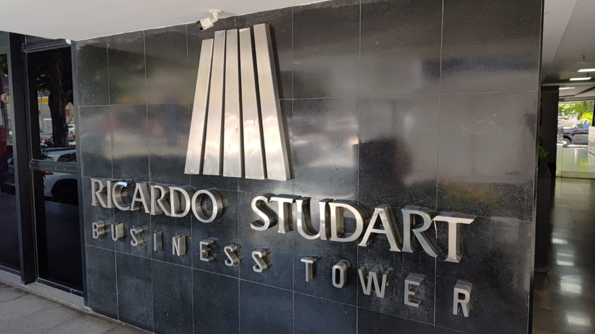

# Proposta Comercial & Técnica: Totem Digital Phygital
## Ricardo Studart Business Tower
📍 **Av. Desembargador Moreira, 1701 — Aldeota, Fortaleza/CE**
### Diretório Inteligente de 66 Salas Comerciais em 12 Pavimentos

---

---

### Resumo Executivo da Solução

Modernização integral da experiência de localização, recepção e atendimento do **Ricardo Studart Business Tower** através de uma solução **Phygital (Físico + Digital)** sem atrito:
Ao aproximar o smartphone via **NFC** ou escanear o **QR Code** no hall de entrada ou recepção, o visitante acessa instantaneamente uma **Aplicação Web Mobile-First ultrarrápida**, com estética corporativa inspirada na identidade do edifício (mármore preto reflexivo e acabamento metálico em aço escovado).

> **Zero Download**: O visitante não precisa baixar aplicativo na Apple Store ou Google Play nem fazer cadastros lentos. O diretório abre em menos de **1 segundo** no navegador nativo do próprio smartphone.

---

### 1. Estrutura Arquitetural do Edifício (66 Salas • 12 Pavimentos)

- **12 Pavimentos Mapeados**:
  1. `SL` — Subsolo / Salão Comercial / Lojas
  2. `MZ` — Mezanino
  3. `1º ao 10º Andar` — Andares tipo (Salas comerciais, consultórios médicos, escritórios jurídicos e financeiros)
- **Capacidade do Projeto**: Mapeamento completo e carga inicial das **66 salas comerciais**.

---

### 2. Modelos Físicos de Apresentação (Hardware)

Para que a administração do condomínio possa escolher o modelo que melhor harmoniza com a portaria e o hall de entrada, apresentamos **3 opções de Parede** e **3 opções de Balcão**:

#### 2.1 Modelos para Parede (Hall de Entrada / Fachada / Acesso Elevadores)

1. **Modelo Parede 1 (Acrílico Cristal + Face em Aço Escovado)**:
   - Base de acrílico cast 8mm cristal bisotado com sobreposição em chapa de aço escovado e 4 parafusos prolongadores de inox cromados.
   - *Fixação*: Parafusos prolongadores ou fita estrutural 3M VHB.
   - Imagem de referência: `assets/images/parede-acrilico-inox.jpg`
2. **Modelo Parede 2 (Black Piano com Moldura Prata e Gravação Espelhada)**:
   - Placa de acrílico preto brilhante com moldura metálica prata fina e gravação a laser cromada reflexiva.
   - *Fixação*: Fixação estrutural invisível com fita 3M VHB (**sem furar o mármore**).
   - Imagem de referência: `assets/images/parede-black-piano.jpg`
3. **Modelo Parede 3 (Monolítica em Aço Inox Cirúrgico 304)**:
   - Chapa maciça de aço inoxidável escovado com cantos chanfrados e gravação profunda a laser em baixo relevo escuro.
   - *Fixação*: Espaçadores discretos de metal ou fita 3M VHB.
   - Imagem de referência: `assets/images/parede-inox-puro.jpg`

---

#### 2.2 Modelos para Balcão (Recepção / Portaria)

1. **Modelo Balcão 1 (Totem L-Shape Curvo Black Piano Ergonômico)**:
   - Acrílico termo moldado preto brilhante com inclinação ergonômica de 65° para leitura natural do smartphone em pé.
   - *Segurança*: Fixação na pedra do balcão por fita 3M VHB ou microventosas de alta sucção antifurto.
   - Imagem de referência: `assets/images/totem-google-reviews.jpg`
2. **Modelo Balcão 2 (Display L-Shape Black Mirror)**:
   - Acrílico preto espelhado fino com alta definição de gravação e design minimalista contemporâneo.
   - Imagem de referência: `assets/images/display-menu-acrilico.jpg`
3. **Modelo Balcão 3 (Totem com Base Pesada / Madeira Nobre)**:
   - Peça em madeira nobre ou bloco translúcido com lastro pesado antiderrapante contra quedas e esbarrões.
   - Imagem de referência: `assets/images/cavalete-madeira-google.jpg`

---

### 3. Política Flexível de Confecção da Placa (Hardware)

Para que o condomínio tenha total transparência e autonomia, a confecção física da placa é tratada como um **item de produção terceirizada à parte**:

* **Opção 1 — Produção com Fornecedor Próprio do Condomínio**:
  - Se o Ricardo Studart já possuir uma empresa de comunicação visual parceira (que confecciona as placas de sinalização do prédio), o condomínio pode mandar produzir diretamente com eles.
  - Nós fornecemos os **arquivos técnicos em vetor de alta resolução (PDF/AI/Corel)** com os gabaritos exatos e enviamos as **tags semicondutoras NFC pré-programadas** prontas para aplicação.
* **Opção 2 — Produção Chave na Mão (Turnkey pela Nolei)**:
  - Nós cuidamos de todo o processo de orçamento, usinagem e gravação com nossos fornecedores especializados e repassamos o custo de produção de forma transparente para aprovação da administração.
* **Desenvolvimento Imediato**:
  - O contrato do software pode ser fechado de imediato, permitindo iniciar o desenvolvimento da plataforma e a carga das 66 salas enquanto a definição da placa física é feita sem pressa.

---

### 4. Escopo da Solução Digital (Aplicação Web & Inteligência)

#### 4.1 Interface do Visitante (Diretório Inteligente)
- **Identidade Visual Premium**: Layout corporativo em sintonia com a fachada do Ricardo Studart (tons escuros elegantes, elementos em aço escovado e tipografia de alto padrão).
- **Filtros por Pavimento**: Botões de acesso rápido (*Todos*, *SL*, *MZ*, *1º*, *2º*, ..., *10º Andar*).
- **Mecanismo de Busca Instantânea**:
  - Busca por **Número da Sala [ID]** (ex: digita "704" e acha em 0.1s).
  - Busca por **Palavra-chave / Especialidade / Nome** (ex: "advocacia", "dentista", "psicologia", "arquitetura", "Dr.", nome da empresa).
- **Ficha Completa de Cada Sala**:
  - Identificação de Andar e Sala.
  - Título / Razão Social ou Nome do Profissional.
  - Especialidade / Resumo de Atuação.
  - Logotipo ou Foto em alta resolução.
  - **Botão Direto para WhatsApp**: Conexão com 1 toque com a secretária, recepção da sala ou agendamento.

#### 4.2 Painel Administrativo com Dashboard de Métricas (USERADMIN)
- **Gestão Autônoma**: O síndico ou recepcionista adiciona, edita ou desativa inquilinos em segundos pelo celular ou computador.
- **Dashboard de Telemetria e Acessos em Tempo Real**:
  - Contagem de toques via **NFC** vs. leituras via **QR Code**.
  - Relatório de visitantes e acessos por **Sala [ID]** (saber quais salas/consultórios têm mais demanda).
  - Relatório dos **termos mais pesquisados** na recepção (ex: "Clínica", "Advocacia", etc.).
  - Gráficos de horários de pico de visitantes na portaria.
- **Custo Zero de Atualização**: Mudanças de sala são atualizadas na hora pelo painel, sem depender de novos gastos gráficos.

---

### 5. Estrutura de Domínio & Hospedagem

| Modalidade | Endereço Web | Hospedagem & SSL | Investimento Adicional |
|---|---|---|:---:|
| **Padrão Nolei (Incluso)** | `noleicreative.com/ricardostudart` *(ou ricardostudart.noleicreative.com)* | Hospedagem em CDN de borda ultrarrápida + Certificado SSL (HTTPS) 100% vitalício inclusos na mensalidade. | **R$ 0,00** |
| **Domínio Próprio Exclusivo (Opcional)** | `ricardostudart.com.br` *(ou totem.ricardostudart.com.br)* | Apontamento de DNS dedicado + gestão de certificado próprio para o domínio do condomínio. | Taxa única de configuração: R$ 150,00 + anuidade Registro.br (~R$ 40/ano) |

---

### 6. Comparativo: Solução Phygital NFC vs. Placas Tradicionais de Hotéis

| Critério Operacional | Sistema de Placas de Hotéis / Condomínios Comuns | Solução Phygital NFC & QR Code Nolei |
|---|---|---|
| **Impacto no Mármore do Hall** | **Poluição Visual Excessiva**: Para exibir 66 salas, exige um painel de quase 2 metros de altura, cobrindo o acabamento nobre do mármore preto. | **Minimalismo Nobre**: Placa discreta em aço escovado que valoriza e respeita a pedra natural do hall. |
| **Custo na Troca de Inquilino** | **R$ 80 a R$ 200 por lâmina**: Cada sala que muda exige encomendar uma nova lâmina de metal na gráfica. | **R$ 0,00 de custo extra**: O administrador entra no painel pelo celular e atualiza em 10 segundos. |
| **Tempo de Atualização** | **15 a 30 dias de atraso**: Até a gráfica cortar e entregar, a sala fica desatualizada ou com adesivo improvisado por cima. | **Tempo Real (Instantâneo)**: Salvou no painel, já atualiza na hora para todos os visitantes. |
| **Interatividade & Contato** | **100% Passivo**: O visitante apenas lê. Se tiver dúvidas, precisa ir até a portaria, pegar fila e pedir o telefone. | **Botão WhatsApp com 1 Toque**: O visitante toca na tela e já abre a conversa com a secretária da sala. |
| **Legibilidade & Acessibilidade** | **Letras Minúsculas**: Comprimir 66 salas num painel físico força letras miúdas, difíceis de ler para idosos. | **Busca Instantânea & Zoom**: O visitante digita "odonto" ou "704" e acha na hora no seu próprio smartphone. |

---

### 7. Proposta Orçamentária

#### 7.1 Setup de Implantação & Instalação Presencial em Fortaleza
Cobre todo o ciclo de desenvolvimento, mapeamento dos 12 pavimentos, carga das 66 salas, programação e testes dos chips NFC e a **visita técnica com entrega presencial e fixação no Ricardo Studart em Fortaleza**.

- **Investimento Total de Setup:** **R$ 2.800,00**
- **Condição de Pagamento Facilitada (50% / 50%):**
  - **1ª Parcela — Sinal na Aprovação (50%):** **R$ 1.400,00** *(pago na assinatura do contrato digital para início imediato do desenvolvimento e carga dos dados)*.
  - **2ª Parcela — Entrega Técnica Presencial (50%):** **R$ 1.400,00** *(pago no ato da fixação física das peças no edifício em Fortaleza e treinamento da equipe de portaria)*.

$$\text{R\$} 1.400,00 \text{ (Sinal)} + \text{R\$} 1.400,00 \text{ (Entrega Técnica)} = \mathbf{\text{R\$} 2.800,00 \text{ Total do Setup}}$$

---

#### 7.2 Mensalidade (SaaS, Hospedagem, Suporte & Dashboard)

| Serviços Inclusos na Mensalidade |
|---|
| Hospedagem de alta performance em nuvem Edge Network com 99.9% de disponibilidade |
| Certificado de segurança SSL (HTTPS) vitalício |
| Banco de dados seguro com rotina diária de backup dos cadastros |
| Acesso contínuo ao **Dashboard de Telemetria** (métricas de acessos NFC, QR Code e por sala) |
| Suporte técnico direto via WhatsApp para a administração do edifício |
| Atualizações de segurança, correções preventivas e melhorias contínuas |

- **Valor da Mensalidade:** **R$ 200,00 / mês**
- **A Matemática do Rateio Condominial:**
  $$\text{Custo por Sala} = \frac{\text{R\$} 200,00}{66 \text{ salas}} = \mathbf{\text{R\$} 3,03 \text{ por sala / mês}}$$

> **Apenas R$ 3,03 por mês por sala comercial**: Isso equivale a apenas 10 centavos por dia por sala, um valor completamente imperceptível na cota condominial e infinitamente mais econômico do que a manutenção de placas convencionais.

---

### 8. Cronograma de Execução em 3 Fases

1. **Fase 1 (Aprovação Remota):**
   - Assinatura do contrato digital de prestação de serviços.
   - Pagamento do sinal de R$ 1.400,00.
   - Envio da relação atualizada das 66 salas pela administração.
2. **Fase 2 (Desenvolvimento & Produção):**
   - Parametrização visual e carga das 66 salas na plataforma.
   - Envio de link de homologação para validação pelo síndico.
   - Definição do modelo de placa e confecção (via fornecedor do condomínio ou Nolei).
3. **Fase 3 (Entrega Presencial em Fortaleza):**
   - Viagem técnica para a Av. Desembargador Moreira previamente agendada.
   - Fixação das placas no Ricardo Studart Business Tower (com auxílio da zeladoria / fita 3M VHB).
   - Teste de aproximação NFC in loco com o síndico e recepcionistas.
   - Treinamento rápido de 15 minutos e quitação da 2ª parcela (R$ 1.400,00).
